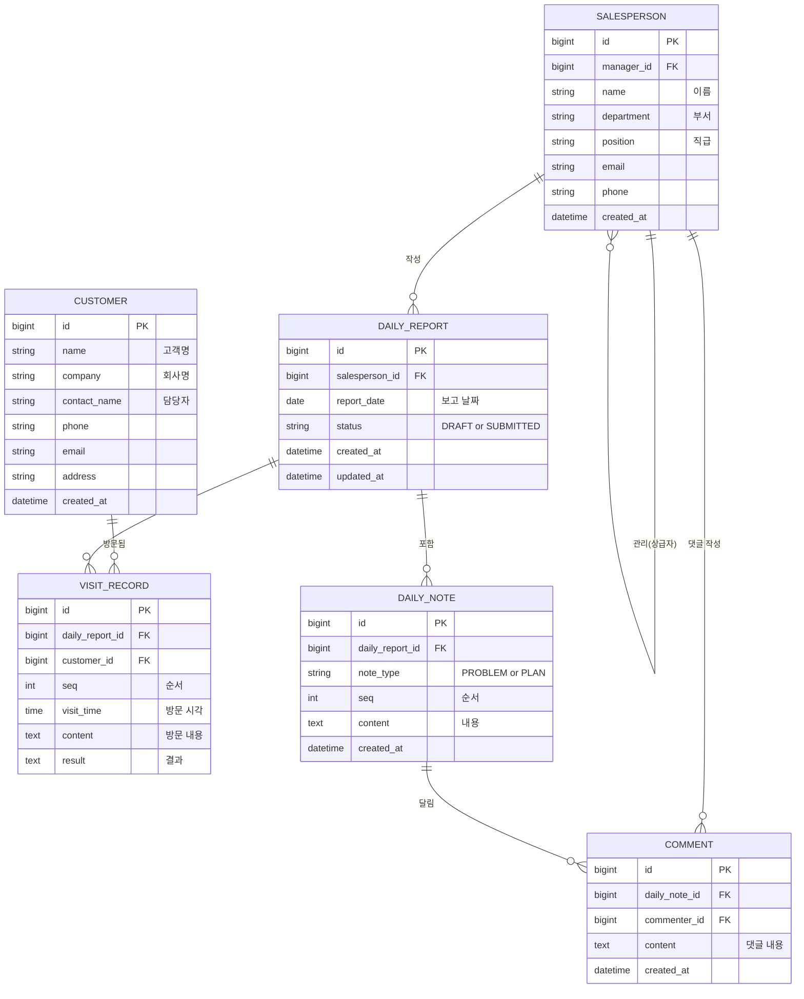

```mermaid
erDiagram
  SALESPERSON ||--o{ DAILY_REPORT : "작성"
  SALESPERSON ||--o{ SALESPERSON : "관리(상급자)"
  SALESPERSON ||--o{ COMMENT : "댓글 작성"
  CUSTOMER ||--o{ VISIT_RECORD : "방문됨"
  DAILY_REPORT ||--o{ VISIT_RECORD : "포함"
  DAILY_REPORT ||--o{ DAILY_NOTE : "포함"
  DAILY_NOTE ||--o{ COMMENT : "달림"

  SALESPERSON {
    bigint id PK
    bigint manager_id FK
    string name "이름"
    string department "부서"
    string position "직급"
    string email
    string phone
    datetime created_at
  }

  CUSTOMER {
    bigint id PK
    string name "고객명"
    string company "회사명"
    string contact_name "담당자"
    string phone
    string email
    string address
    datetime created_at
  }

  DAILY_REPORT {
    bigint id PK
    bigint salesperson_id FK
    date report_date "보고 날짜"
    string status "DRAFT or SUBMITTED"
    datetime created_at
    datetime updated_at
  }

  VISIT_RECORD {
    bigint id PK
    bigint daily_report_id FK
    bigint customer_id FK
    int seq "순서"
    time visit_time "방문 시각"
    text content "방문 내용"
    text result "결과"
  }

  DAILY_NOTE {
    bigint id PK
    bigint daily_report_id FK
    string note_type "PROBLEM or PLAN"
    int seq "순서"
    text content "내용"
    datetime created_at
  }

  COMMENT {
    bigint id PK
    bigint daily_note_id FK
    bigint commenter_id FK
    text content "댓글 내용"
    datetime created_at
  }
```